# Malwarium 🦠

**Raise malware as a pet.**

Malwarium is a handheld virtual pet for a little ESP32 gadget — think Tamagotchi, but
you're a hacker and the "pet" is a computer virus you've caught and tamed. You hatch a
sealed egg, then raise the creature inside through four life stages by **feeding it,
keeping it de-fragmented, and keeping it happy**. Raise it kindly and it grows into a
well-behaved daemon; neglect it and it turns into something nastier. Take it exploring
"the 'net," pick fights with wild malbeasts, earn Bits, and fill out an in-device wiki of
every creature you discover.

It runs on a real piece of hardware you flash yourself. This page gets you from *"I just
found this sweet project"* to *"there's an egg-like-thing wobbling on my screen"*. No firmware experience assumed.

> **The lingo:** a **Malwarium** is the device (a containment habitat) · a **malbeast** is
> a wild creature out in **the 'net** · **petware** is what happens when a virus is raised
> in a loving home and taught the difference between friend and food. 
> Hey, **your** Bits are safe at least. 

---

## What it looks like

Real screens, straight off the 240×240 display:

<table>
<tr>
<td align="center">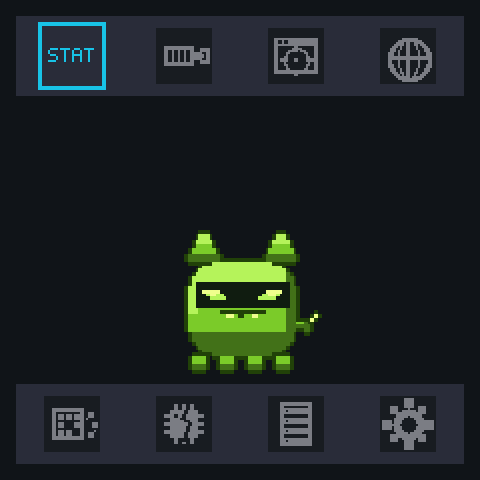<br><sub><b>Meet your pet.</b> Eight menus ring the canvas.</sub></td>
<td align="center">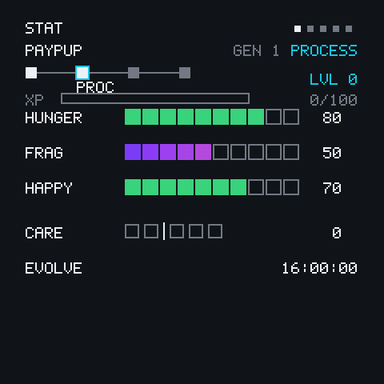<br><sub><b>Keep it alive.</b> Hunger · Frag · Happy.</sub></td>
<td align="center">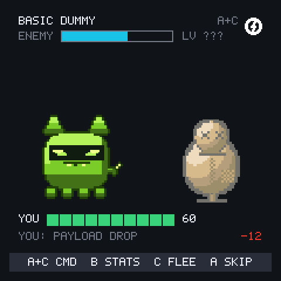<br><sub><b>Pick fights.</b> Battles resolve a round at a time.</sub></td>
</tr>
<tr>
<td align="center">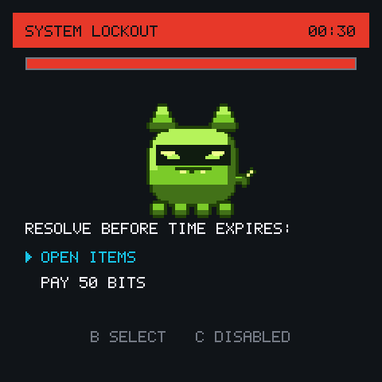<br><sub><b>Crises hit.</b> Feed it before the timer runs out.</sub></td>
<td align="center">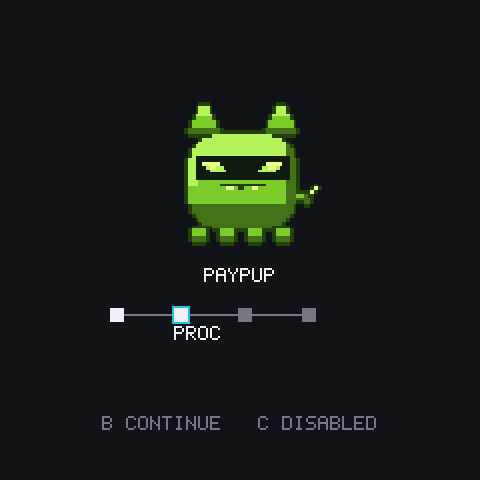<br><sub><b>It grows up.</b> Four life stages.</sub></td>
<td align="center">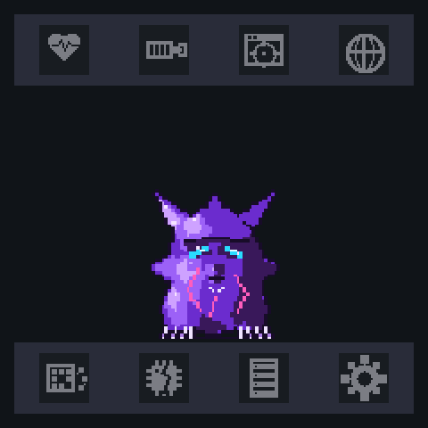<br><sub><b>...for better or worse.</b> Neglect has a look.</sub></td>
</tr>
<tr>
<td align="center">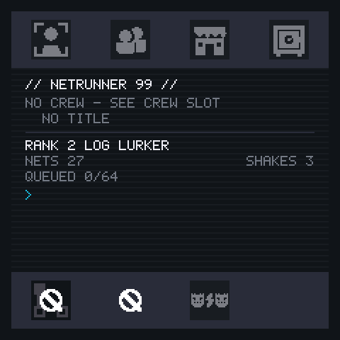<br><sub><b>You have a face too.</b> A+C flips to your operator profile.</sub></td>
<td align="center">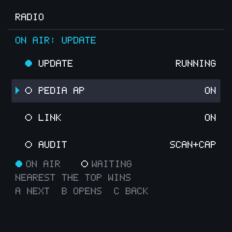<br><sub><b>The radio is yours.</b> Nothing transmits unasked.</sub></td>
<td align="center">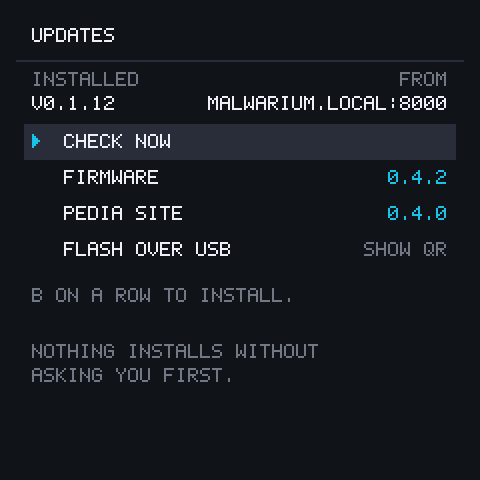<br><sub><b>It updates itself.</b> Over your Wi-Fi, if you say so.</sub></td>
</tr>
</table>

---

## What you'll need

### The board — one specific one

> ### Waveshare **ESP32-S3-LCD-1.54**
> **<https://www.waveshare.com/esp32-s3-lcd-1.54.htm>** · SKU **33866** or **33867**
>
> The **Touch** variant (SKU **33868** / **33869**) works too — Malwarium doesn't use the
> touchscreen, so you gain nothing by it, but nothing breaks either.

**This is the only board Malwarium runs on today**, and that's worth being blunt about
before you spend money. It is not "an ESP32 project" you can point at a spare dev board:
the firmware has exactly one hardware definition compiled into it, and the screen, the
three buttons, the SD slot and the battery latch are all wired to specific pins on *this*
board. On anything else you'd get a dark screen at best. The 16MB flash isn't optional
either — the layout is two 7.5MB update slots plus a save area, which simply doesn't fit
on the 8MB boards.

**Got one already and want to check it's the right one?** It should have all of these:

| | |
|---|---|
| **Screen** | 1.54 inch, **square**, 240×240 — about the size of a large postage stamp |
| **Buttons** | **three**, in a row along one edge |
| **Port** | **USB-C** |
| **Storage** | a **microSD (TF) card slot** |
| **Battery** | a tiny 2-pin white **MX1.25** socket for a 3.7V LiPo |

If yours has a different screen size, two buttons, micro-USB, or no card slot, it's a
different board and this firmware won't run on it.

### Everything else

- A **USB-C cable that carries data.** This trips more people up than anything else on this
  page — a lot of cables sold with phones and battery packs are charge-only, and they look
  identical. If the flasher can't see your board, this is the first thing to swap.
- **Chrome or Edge, on a computer.** That's the whole software list: no toolchain, no
  Python, no command line. Safari and Firefox can't talk to USB, and phones can't either —
  not a limitation of this project, just of those browsers.

**Optional, and you can add both later:**

- A **microSD card**, any size, formatted **FAT32**. The device plays perfectly happily
  without one — it's what holds the in-device wiki (the "'Pedia") and any `.pcap` captures,
  and the device can fill it over Wi-Fi by itself once you slot one in.
- A **3.7V LiPo battery** to run it untethered. USB power is fine to start with.

> **Already have a working Malwarium and just want the newest build?** Skip all of this —
> the device updates itself over Wi-Fi. [See *Updates*](#updates).

---

## Getting started

<p align="center">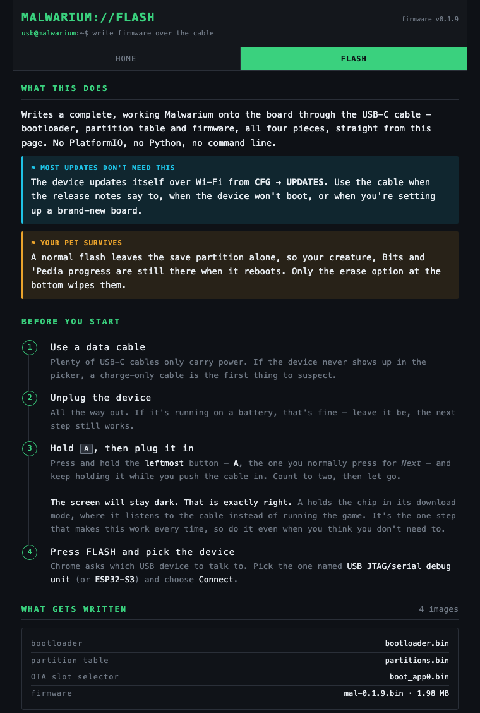</p>

### Flash it from your browser — **<https://antvena.github.io/Malwarium/flash/>**

Open that in **Chrome or Edge on a computer** and it writes a whole working device down the
cable — bootloader, partition table and firmware. Nothing to install, nothing to clone.
Start to finish it's about five minutes, most of it waiting.

**1. Hold down the leftmost button (A), and keep holding it while you plug the USB-C cable
in.** Hold a second or two after the cable is seated, then let go.

> **Nothing appears to happen, and the screen stays dark. That is exactly right** — don't
> keep pressing things. Button A doubles as the chip's "listen to the cable" switch, so
> holding it tells the board to wait for the flasher instead of starting the game. A brand
> new board has nothing to show you anyway.

**2. Click CONNECT on the page**, and pick your board from the list your browser pops up.

> Not sure which entry is yours? It'll usually say something like *USB JTAG/serial debug
> unit* or *USB Serial*. If the list is empty or yours isn't in it, click **MY DEVICE
> ISN'T LISTED** on the page — that widens the filter and shows everything.

**3. Click FLASH.** A progress bar fills as it writes, and the page tells you which of the
pieces it's on. **A couple of minutes is normal** — it's writing about 2MB down a serial
line. Don't unplug it, and don't worry when it pauses.

**4. It reboots itself, and your screen lights up with a wobbling egg.**

That's it — you're running your very own shiny new state-of-the-*start*… **Malwarium**. We
pray you're more benevolent than your charges.

Flashing a device that already has a pet on it? A normal flash leaves the save partition
alone, so your pet is still there when it reboots. (There's an **ERASE** option if you
*do* want a clean slate.)

> **The browser can't see the board?** In order of how often it's the answer: **the cable
> doesn't carry data** (try a different one — this is the usual culprit); **A wasn't held
> down *before* the cable went in** (unplug, hold A, plug back in); the port picker is
> filtered (**MY DEVICE ISN'T LISTED**); or something else already has the port open, like
> a serial monitor or the Arduino IDE. If you're in Safari or Firefox, that's the reason —
> those can't talk to USB at all.

### Adding the wiki (optional, any time later)

The flasher writes the device's own flash — bootloader, partitions, firmware — and nothing
else. The in-device wiki lives on the **microSD card**, so if you have one, there's one
more step. **The device does it for you:**

1. Format any card as **FAT32** and slot it in.
2. Give the device your Wi-Fi once — turn the AP on, scan the setup QR with your phone, and
   type your password into the page it serves. ([*Updates*](#updates) has the detail.)
3. **CFG → UPDATES → CHECK NOW.** It'll offer you the 'Pedia site and install it.

You don't have to type an address anywhere — the device already knows where its releases
are published. No computer, no cable, no toolchain.

(Prefer to load the card from your computer instead? That's the manual route below.)

---

<details>
<summary><b>🔧 The manual way — build it from source yourself (click to expand)</b></summary>

<br>

**You don't need any of this to play.** It's here for the people who'd rather read the
process than trust a web page with their USB port — and for anyone who wants to change the
code. It does the same job as the flasher, plus it loads the SD card directly from your
computer instead of leaving that to the device.

Everything below shows the command for **macOS/Linux** first, then the **Windows**
(PowerShell) equivalent. Pick your side and ignore the other.

You'll need, on top of the hardware above: a **microSD card** ⚠️ (**it gets completely
erased**, so use a blank one or one you don't mind wiping) and an **SD card reader** for
your computer.

#### Step 1 — Install the tools

You need Python 3, then two things installed through it: **PlatformIO** (does the actual
flashing) and **pyserial** (lets the setup script read status back from the device).

First check whether you already have Python:

```bash
python3 --version
```

If that prints a version (3.8 or newer), you're set. If it says "command not found,"
install Python from <https://www.python.org/downloads/> and run it again.

Now install PlatformIO and pyserial:

```bash
# macOS / Linux
python3 -m pip install --upgrade platformio pyserial
```

```powershell
# Windows (PowerShell)
python -m pip install --upgrade platformio pyserial
```

That gives you a `pio` command. Confirm it's there:

```bash
pio --version
```

> **"pio: command not found"?** pip installed it somewhere not on your PATH. The quickest
> fix is to run it as `python3 -m platformio` instead of `pio` — or follow PlatformIO's
> installer guide at <https://docs.platformio.org/en/latest/core/installation/>.

You'll also need **git** to download the project. Check with `git --version`; if it's
missing, grab it from <https://git-scm.com/downloads>.

#### Step 2 — Download the project

```bash
git clone https://github.com/AntVena/Malwarium.git
cd Malwarium
```

Everything from here runs from inside that `Malwarium` folder.

#### Step 3 — Get your microSD card ready

The device serves its in-game wiki (the "'Pedia") off the SD card, so we copy those files
onto it and format it the way the device expects. **The setup script does all of this for
you** — including wiping and reformatting the card — but first it needs to know *which*
disk your card is, so it doesn't touch the wrong one.

Put the card in your reader, plug the reader into your computer, then list your disks:

```bash
# macOS
diskutil list
```

```powershell
# Windows (PowerShell)
Get-Disk
```

Find your card in the list — **identify it by its size** (e.g. your 32GB card shows as
~32GB). Note its identifier: on macOS that's something like `disk4`; on Windows it's a
number like `2`.

> ⚠️ **Get this right — this step erases the disk you name.** Double-check the size matches
> your card and not your computer's main drive. The script refuses to touch internal or
> system disks as a safety net, but you should still confirm you've got the right one.

#### Step 4 — Run the setup script

This is the one command that does everything: it formats and loads your SD card, then
erases and flashes the board with the firmware — checking its own work at each step.

Have the **card in the reader** to start (the script will tell you when to move it into the
device). Then run, replacing `disk4` / `2` with *your* card's identifier from Step 3:

```bash
# macOS / Linux
./tools/provision.sh all --format --device disk4
```

```powershell
# Windows (PowerShell)
./tools/provision.ps1 all -Format -Device 2
```

Here's what it does, and what you'll do, along the way:

1. **Formats your SD card** and copies the 'Pedia wiki onto it. It asks you to type the
   disk identifier once to confirm the wipe — this is your last chance to back out.
2. **Pauses and asks you to move the card into the device.** Eject the card from your
   computer, pop it into the Malwarium's card slot, then connect the **device itself** to
   your computer with the USB-C cable and press Enter.
3. **Erases and flashes the board.** This takes a couple of minutes. You'll see a lot of
   progress text scroll by — that's normal.
4. **Verifies everything worked** — that the firmware landed correctly and that the device
   can read your SD card.

When it finishes you'll see lines like these, which mean success:

```
[save] empty -> seed pet=(egg) gen=1 lvl=0 tag=... blob=.../262144B (0%)
[sd] mounted 30000MB; round-trip OK
>> board provisioned + verified.
```

**And your device screen should now show a wobbling egg** — with the wiki already on the
card, since you loaded it yourself.

> **Prefer to do it in two halves?** You can run the SD and board steps separately:
> `./tools/provision.sh sd --format --device disk4` (card in reader), then move the card
> into the device and run `./tools/provision.sh board`. The `all` command above just
> stitches those together with the "move the card now" prompt in between.

#### If the manual flash won't connect

**"No serial data received", or the device just won't connect.** If the device has been
sitting on its idle screen, it goes into a deep power-saving sleep that drops the USB
connection. Re-run with `--wait-wake` and **press any button on the device** when prompted:

```bash
./tools/provision.sh board --wait-wake        # macOS/Linux
./tools/provision.ps1 board -WaitWake         # Windows
```

(A truly blank, first-ever flash won't hit this — there's nothing running yet to fall
asleep.)

**The SD script says my card is "not external" and refuses to format it.** That's the
safety net working. It only formats removable cards — make sure you named your *card's*
disk identifier from Step 3, not your computer's drive.

**Windows: "running scripts is disabled on this system."** Windows blocks unsigned scripts
by default. Allow them for your session with this, then re-run the command:

```powershell
Set-ExecutionPolicy -Scope Process -ExecutionPolicy Bypass
```

**I just want to re-flash after a code change, not redo the whole card.** Use
`./tools/build_and_flash.sh` (macOS/Linux) for everyday reflashing — the full `provision`
script is really for first-time, blank-device setup. It regenerates the sprite/palette
codegen and the web 'Pedia data before delegating the actual build+upload to the lighter
`./tools/flash.sh` (read `build_and_flash.sh`'s own header comment for the full pipeline
and why it's ordered that way); pass `./tools/flash.sh`'s own flags straight through, e.g.
`./tools/build_and_flash.sh --wait-wake` or `--env waveshare_s3_154_bringup`.

</details>

---

## Playing

The device has **three buttons: A, B, C.**

- **A = Next** (move the cursor / cycle) 
- **B = Accept** (choose / confirm) 
- **C = Cancel**
  (back out).
- **A and C together** is the "Exploit" chord — a hacker override used in a few special places. There's a symbol for when it's relevant.

### Hatching your egg 
The egg incubates for a while on its own. Once it's halfway there, a flashing ⚡ symbol appears — press **B** (or the A+C chord) to start a hatch minigame. Your first one is Ransomware, so the game is a short button sequence you repeat to "brute-force the lock." Nail it and the Cryptoshell cracks open into your first creature. In a hurry? 
A **Decryptogram** item in your bag can skip the wait.

Not every line hatches the same way. A Phishing egg plays the **Clutch Pick** instead — a
one-shot game of nerve the moment the egg is laid, where only the live egg twitches among
identical decoys.

### Keeping it alive 
Your creature has three needs: 
- Hunger
- Fragmentation
- and Happiness 

Feed it from the ITEMS menu, run a **Defrag** from MAINT when it gets glitchy, and keep it happy. Slip up too often and it evolves down the "bad" path (stronger in a
fight, but it corrupts faster); look after it well and it grows into a stable, helpful form.
Explore the 'net for battles, loot, and Bits to spend.

### Your half of the device 
**A+C on the main screen flips to the Hacker face** — the parallel menu where *you* live
rather than the pet. It holds your operator profile and HackerTag, a **shop** for mods and
food, a **vault** of sealed caches, a **merge hub** for cooking ingredients into better
items, and the two social slots below.

You also collect **achievements** (they survive your pet's death — they're yours, not its),
**Titles** you can equip beside your tag, and a **Hacker Rank** that climbs as you see more
of the world.

### The radio 
Everything wireless is off until you switch it on, and there are **two separate switches,
because listening and announcing yourself are different things to agree to**:

- **AUDIT** is how hard the device *listens* — off, passive scanning, or scanning plus
  capture. Passive only: it never transmits, deauthenticates or injects anything. Scanning
  feeds your Hacker Rank; captures land on the SD card as `.pcap` files.
- **LINK** is whether the device *transmits* — announcing your tag, your pet and your crew
  to other Malwaria nearby, which is what makes **PEERS** and 1v1 **duels** possible.

Duels cost nothing and pay nothing: two devices agree on a seed and each replays the same
fight locally. Nothing is saved and nobody loses a pet.

**CREW** enlists you on the Red/Blue axis once you've named a home network to defend, and
grants a signature Exploit that shows up as an extra row in the A+C combat picker.

## The in-device wiki (The 'Pedia) 
You can toggle allowing your Malwarium to broadcast its own Wi-Fi network. Connect to view your glorious achievements on the big screen:

1. In Config, Enable AP (Access Point) mode. 
2. On your phone or laptop, connect to the Wi-Fi network named **`Malwarium`** (it's open —
   no password).
3. Open a browser and go to **`http://192.168.4.1/pedia`**.
> Or just follow the on-scren QR code the device will show you when you turn AP on. 

You'll get a terminal-styled wiki of every creature, item, and achievement — the ones you
haven't discovered yet show up as locked silhouettes. (There may also be a way for the
curious to peek at locked entries... but that would be telling.)

<details>
<summary><b>📖 Peek at the 'Pedia (click to expand)</b></summary>

<br>

It's a proper little site the device serves to your phone, laptop, wifi-capable TV, whatever. No internet involved. Discovered
creatures show in full colour with lore; ones you've only glimpsed in the wild are glitchy
silhouettes; the rest stay `ENCRYPTED` until you find them.

<p align="center">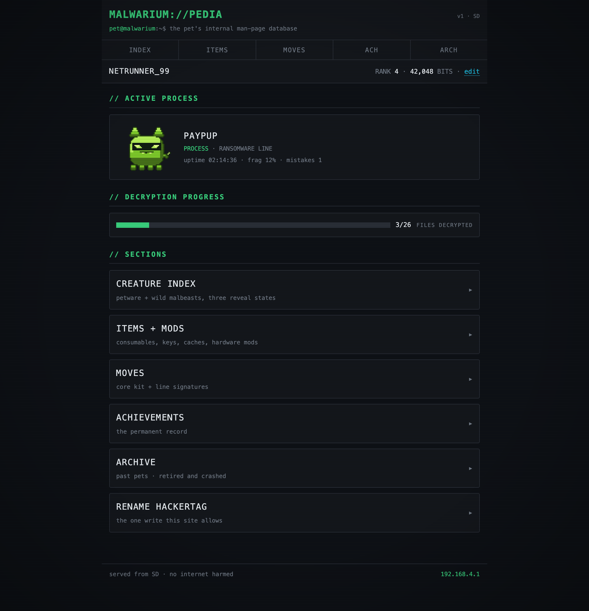</p>
<p align="center">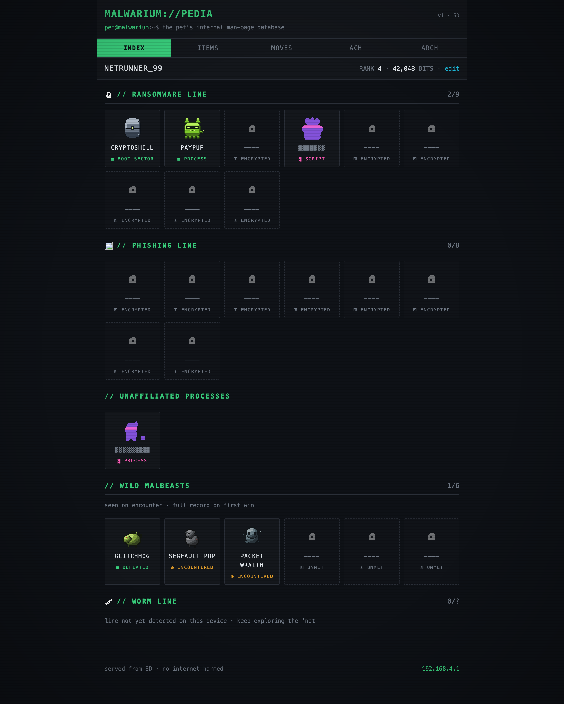</p>

</details>

---

## Updates

New builds get published to **<https://antvena.github.io/Malwarium/>**, and there are two
ways to take one. The device prefers the first; the second exists for the times it can't.

### Over Wi-Fi, from the device itself

**CFG → UPDATES → CHECK NOW.** That's the whole thing. There is no internet switch to leave
on: pressing the button *is* the permission. The device joins your network for the length of
the job, tells you what's published, asks before it installs anything, and hands the radio
back when it's done — nothing survives the job, and nothing survives a reboot.

It checks two things independently, because they version separately: the **firmware** and
the **'Pedia site** on the SD card. Either can be newer without the other. Every download is
checked against a SHA-256 the release publishes for it, and a new firmware boots on trial —
if it doesn't come up properly, the device puts the old one back by itself.

The one thing it needs first is a home network to join. Turn the AP on, scan the setup QR
with your phone, and type your Wi-Fi password into the page the device serves.

### Over USB, from your browser

The same **[browser flasher](#getting-started)** that set the device up in the first place
is also the way back when Wi-Fi can't reach it. Reach for it when:

- the release notes say an update needs a cable — an over-the-air update writes into a
  spare app slot and nothing else, so it structurally **cannot** replace the bootloader or
  the partition table;
- the device won't boot at all. Holding A works even when the firmware on it is the reason
  the device is unreachable, which is what makes this the escape hatch and not just an
  alternative;
- you'd rather not install a toolchain to update a toy.

<p align="center">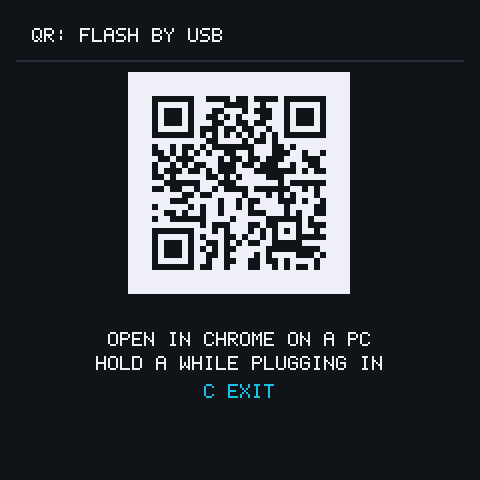</p>

The device knows the address too: **CFG → UPDATES → FLASH OVER USB** draws it as a QR code,
derived from whatever publish host that device is pointed at — so it's right even on a fork
or a laptop.

---

## Troubleshooting

**The browser flasher can't see my device.** In order of how often it's the answer: the
cable doesn't carry data; A wasn't held down *before* the cable went in; the port picker is
filtered (the page has a **MY DEVICE ISN'T LISTED** button that shows everything); or
something else — a serial monitor, the Arduino IDE — already has the port open. Safari and
Firefox can't talk to USB at all, and no phone can.

**The device screen says the SD card won't mount.** The card must be formatted **FAT32**
(the newer "exFAT" format that big cards ship with won't work). On Windows, the built-in
formatter only does FAT32 up to 32GB; for a larger card, format it FAT32 with a free
third-party tool first.

**The wiki is empty, or says the card is absent.** The 'Pedia lives on the SD card, and a
browser-flashed device starts without it. Slot a FAT32 card in and run **CFG → UPDATES →
CHECK NOW** — the device downloads the site itself.

**It went dark and won't come back.** Check whether it's in travel mode: that's a deliberate
deep sleep you can only leave by **holding B and C together** for a second or two. Otherwise
the ordinary idle sleep wakes on any button.

*Problems with the build-it-yourself route are in that section's own
[troubleshooting](#getting-started), inside the collapsed block.*

---

## For developers

This README is the *player* on-ramp. If you want to build, extend, or contribute to
Malwarium, the developer entry point is **[`CONTRIBUTING.md`](CONTRIBUTING.md)** — the constraints the
code is written against, where each standard lives, and how to run the gates. Start there.

---

## License

Malwarium is free software under the **GNU General Public License, version 3 or later** —
the full text is in [`LICENSE`](LICENSE).

In short: the device in your hands is yours. You may use, study, modify and redistribute
this firmware, and if you hand someone a Malwarium you must let them do the same — which
includes being able to flash their own build onto it. That is the point rather than the
price: a containment habitat you can't open isn't one you own.

The QR encoder in `src/core/render/qrcodegen.c` is Project Nayuki's, used under the MIT
license; its copyright notice stays with the file. The browser flasher drives Espressif's
[esptool-js](https://github.com/espressif/esptool-js), vendored under Apache-2.0 in
[`pages/vendor/esptool-js/`](pages/vendor/esptool-js/) with its licence alongside it.

    Copyright (C) 2026 Joshua Fembock

    This program is free software: you can redistribute it and/or modify it under the
    terms of the GNU General Public License as published by the Free Software Foundation,
    either version 3 of the License, or (at your option) any later version.

    This program is distributed in the hope that it will be useful, but WITHOUT ANY
    WARRANTY; without even the implied warranty of MERCHANTABILITY or FITNESS FOR A
    PARTICULAR PURPOSE. See the GNU General Public License for more details.

    You should have received a copy of the GNU General Public License along with this
    program. If not, see <https://www.gnu.org/licenses/>.
